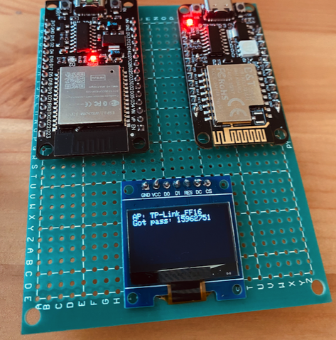
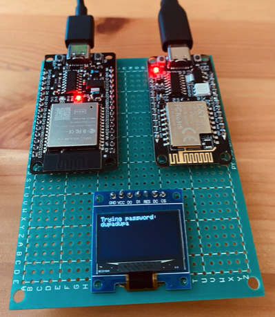

# BW16-ESP32-Evil-Twin
This project is implementing features known from Airgeddon, but on 2 tiny boards: “Esp32” and “RTL8720DN BW16” (plus an SPI screen).

It is based on beatiful 
[TesaKlebeband ](https://github.com/tesa-klebeband/RTL8720dn-Deauther)
and unfinished https://github.com/aadesh0706/IOT-ESP32-Evil-Twin-WiFi-Hacking-Deauthentication-Captive-Portal

# Features
It’s able to:
- Deauthenticate more than one network (both 2.4 and 5GHz)
- Pursuit Mode: Periodically check if router did not change the channel (which happens after frustrated user reboots it)
- Clone one selected network as Evil Twin (when user joins it is fooled to enter password)
- Validate if password is correct
- If yes, show this password on the screen and stop deauth and stop evil twin portal so user thinks he/she just upgraded their router

What is NOT supported: 
1. Evil twin page customisation. You need to edit source code yourself if you wish to change the default look and feel.
2. Spoof BSSID - your board bssid will be seen in wireshark

# BOM
Bill of material:
 - ESP32 (30 or 38 pins will do)
 - RTL8720DN (BW16) (do not buy BW16E - it does not see 5ghz networks)
 - 0.96 OLED SPI SSD1306 screen (I2C version coming soon)

Cost: each board approx 5 euros, screen 1 euro on Chinese portals.

# Usage
Connect USB-C plug to any of the boards. It's enough to power just one - their VINs and GNDs are connected.
Check the screen and connect your phone to hotspot as indicated. 
Enter the provided IP address in your browser and:
- Select networks to deauth using checkboxes
- Select one network to be cloned in drop-down below
- Click start button or rescan if you have changed your location

After starting the attack, the page will disappear - boards are busy. You may now disconnect from the hotspot. 

Next, verify that all clients have been kicked out of selected networks. 
Also check if evil twin unsecured network has been set up, connect to it and check if you can see fake router update page asking to enter password. 
Enter some rubbish password and check the oled screen - it will tell if it tries to verify a password provided by user and if this attempt was successful. 

# Build process / cables wiring

OLED - ESP32:
 - GND - GND
 - VCC - 3V3
 - D0 - D18
 - D1 - D23
 - RES - D16
 - DC - D17
 - CS - D5

BW16 - ESP32
 - 5V - VIN
 - GND - GND
 - PA26 - D21
 - PA25 - D22

# Deployment to boards
1. Master file is to be deployed onto BW16. You need to add this path to Arduino IDE in order to be able to select the RTL8720DN (BW16) board:
https://github.com/ambiot/ambd_arduino/raw/master/Arduino_package/package_realtek_amebad_index.json

2. Slave file is to be deployed to ESP32. You need to add this board: https://raw.githubusercontent.com/espressif/arduino-esp32/gh-pages/package_esp32_index.json and the select NodeMCU-32S. 

# Pictures

